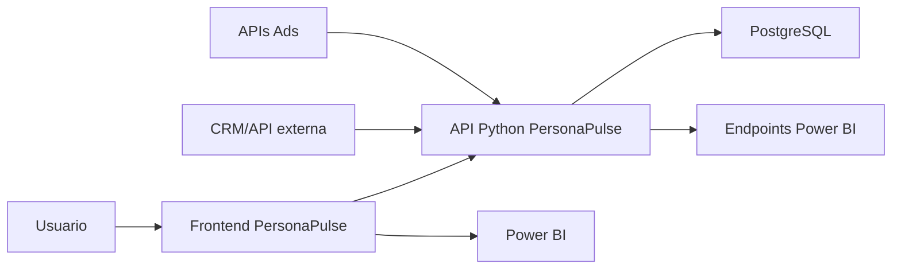

# PersonaPulse AI - Documentacao tecnica de desenvolvimento

## Objetivo do MVP

O PersonaPulse AI e um prototipo navegavel para consolidar clientes, compras, campanhas, fontes de dados e metricas executivas em uma experiencia simples para marketing e negocio.

O MVP atual evita coleta invasiva de dados e trabalha com fontes declaradas, importadas ou integradas com consentimento, como CSV, CRM, APIs de Ads e endpoints para Power BI.

## Arquitetura atual



## Principais componentes

- Frontend da aplicacao: `APIS/personapulse-api/static/personapulse/index.html`
- Backend/API: `APIS/personapulse-api/server.py`
- Configuracao Render: `render.yaml`
- Documentacao da API: `APIS/personapulse-api/README.md`
- Documentos de produto/organograma: arquivos `.docx` dentro de `DOCUMENTOS/`
- Imagens de interface: `interfaces.PNG/`
- Bases CSV: `CSV/`
- Scripts de geracao e apoio: `scripts/`
- Guia PostgreSQL: `docs/BANCO_POSTGRESQL.md`

## URLs publicas

- Aplicacao: `<URL_PUBLICA_DA_API>/app`
- API/docs: `<URL_PUBLICA_DA_API>/docs`
- Health check: `<URL_PUBLICA_DA_API>/health`

## Fluxo de dados do MVP

1. Usuario importa CSV, sincroniza CRM ou integra fonte externa.
2. Frontend consolida clientes, campanhas, compras e metricas.
3. API recebe dados e snapshots consolidados.
4. Dashboard do PersonaPulse mostra visao operacional.
5. Endpoints Power BI entregam dados em JSON para painel executivo.

## Endpoints principais

### CRM

- `POST /api/crm/customers`
- `GET /api/crm/customers`
- `POST /api/crm/orders`
- `GET /api/crm/orders`
- `POST /api/crm/events`
- `GET /api/crm/events`

### Campanhas e recomendacoes

- `GET /api/segments`
- `GET /api/campaigns`
- `POST /api/campaigns/generate`
- `GET /api/recommendations`
- `POST /api/crm/recommendations/push`

### Ads

- `POST /api/meta-ads/campaigns`
- `GET /api/meta-ads/campaigns`
- `POST /api/meta-ads/insights`
- `GET /api/meta-ads/insights`
- `POST /api/meta-ads/leads`
- `GET /api/meta-ads/leads`
- `POST /api/ads/{source}/campaigns`
- `GET /api/ads/{source}/campaigns`
- `POST /api/ads/{source}/insights`
- `GET /api/ads/{source}/insights`
- `POST /api/ads/{source}/leads`
- `GET /api/ads/{source}/leads`

### Power BI

- `GET /api/powerbi/executive-summary`
- `GET /api/powerbi/customers`
- `GET /api/powerbi/campaigns`
- `GET /api/powerbi/sources`
- `POST /api/powerbi/snapshot`

## Integracao Power BI

No Power BI Desktop, usar `Obter dados > Web` e conectar os endpoints:

- `<URL_PUBLICA_DA_API>/api/powerbi/executive-summary`
- `<URL_PUBLICA_DA_API>/api/powerbi/customers`
- `<URL_PUBLICA_DA_API>/api/powerbi/campaigns`
- `<URL_PUBLICA_DA_API>/api/powerbi/sources`

Quando o Power BI mostrar campos do tipo `List` ou `Record`, expandir a lista correta:

- `customers` para clientes
- `campaigns` para campanhas
- `sources` para fontes

O endpoint `executive-summary` deve manter schema estavel, mesmo sem dados, para evitar quebra de colunas no Power BI.

## Persistencia atual

Hoje a API usa PostgreSQL como persistencia oficial:

- usa PostgreSQL quando a variavel `DATABASE_URL` esta configurada;
- sem `DATABASE_URL`, a API retorna erro de configuracao e nao grava dados;

Schemas SQL:

- `APIS/personapulse-api/migrations/001_app_store_postgresql.sql`
- `APIS/personapulse-api/migrations/002_relational_model.sql`

Entidades sugeridas para o banco:

- `customers`
- `orders`
- `events`
- `campaigns`
- `campaign_metrics`
- `data_sources`
- `recommendations`
- `audit_logs`
- `powerbi_snapshots`
- `connector_configs`

## Regras de seguranca e LGPD do MVP

- Dados pessoais devem ter origem declarada.
- Clientes sem consentimento de marketing devem ser excluidos de disparos.
- Tokens e secrets devem ficar no backend, nunca no navegador.
- Logs de auditoria devem registrar importacoes, sincronizacoes e geracao de recomendacoes.
- Dados sensiveis devem ser minimizados no painel executivo.

## Como rodar localmente

```powershell
cd APIS/personapulse-api
python server.py
```

Abrir:

```text
http://127.0.0.1:8088/docs
```

## Deploy

O deploy atual usa Render com:

- Build Command: `pip install -r requirements.txt`
- Start Command: `python server.py`
- Health Check Path: `/health`
