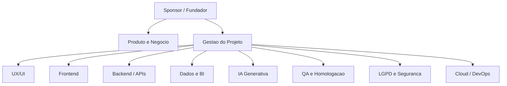

# PersonaPulse AI - Organograma do projeto

## Organograma visual

## Formato hierarquico

1. Sponsor / Fundador
2. Produto e Negocio
3. Gestao do Projeto
4. UX/UI
5. Frontend
6. Backend e APIs
7. Dados e BI
8. IA Generativa
9. QA e Homologacao
10. LGPD e Seguranca
11. Cloud e DevOps

## Responsabilidades por area

### Sponsor / Fundador

- Define visao de produto.
- Aprova escopo do MVP.
- Prioriza proximas entregas.

### Produto e Negocio

- Define jornadas do usuario.
- Valida proposta de valor.
- Traduz necessidades comerciais em funcionalidades.

### Gestao do Projeto

- Organiza backlog.
- Controla entregas, riscos e dependencias.
- Mantem documentacao viva.

### UX/UI

- Desenha telas e fluxos.
- Mantem consistencia visual.
- Reduz friccao no uso da ferramenta.

### Frontend

- Implementa dashboard navegavel.
- Integra chamadas de API.
- Garante exportacoes, filtros e visualizacao dos dados.

### Backend e APIs

- Implementa endpoints do PersonaPulse.
- Integra CRM, Ads e Power BI.
- Centraliza tokens e credenciais no servidor.

### Dados e BI

- Modela dados.
- Define indicadores executivos.
- Prepara integracao com PostgreSQL e Power BI.

### IA Generativa

- Gera sugestoes de campanhas.
- Mantem templates editaveis.
- Ajuda na criacao de variacoes criativas.

### QA e Homologacao

- Testa fluxos criticos.
- Valida importacao, sincronizacao e exportacao.
- Confere comportamento antes de deploy.

### LGPD e Seguranca

- Define politicas de consentimento.
- Avalia riscos de dados pessoais.
- Orienta armazenamento e minimizacao de dados.

### Cloud e DevOps

- Mantem deploy no Render.
- Configura variaveis de ambiente.
- Planeja migracao para PostgreSQL.

